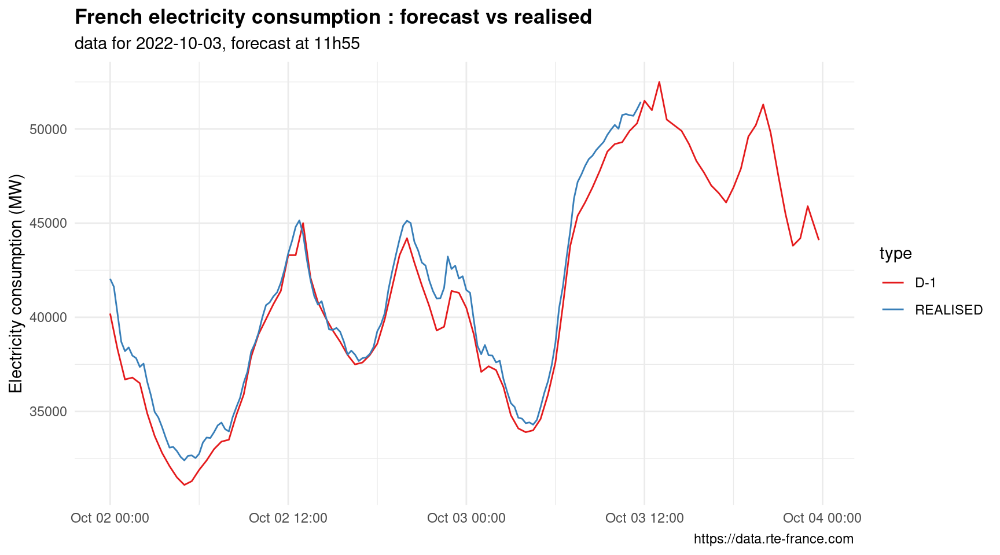
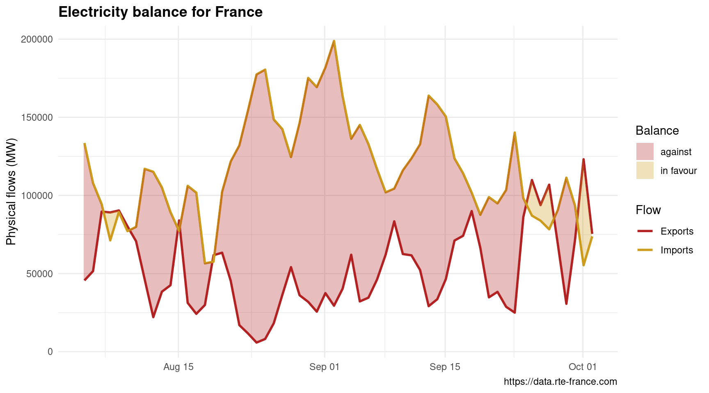

rte.data
========

> Access data from RTE data portal

[](http://www.repostatus.org/#wip) [](https://travis-ci.org/dreamRs/rte.data)

Overview
--------

RTE, the french electricity transmission system operator, provides access to various data through an API on its (data portal)\[<https://data.rte-france.com/home>\]. You can retrieve those data with `rte.data`.

Installation (from Github) :

``` r
source("https://install-github.me/dreamRs/rte.data")

# or
devtools::installl_github("dreamRs/rte.data")
```

Authentication
--------------

To access the API, you need to (create an account)\[<https://data.rte-france.com/create_account>\], or login if you have one.

Once logged, you can subscribe (create an application) to the desired API (each APIs must be subscribed individualy), you'll obtain an `client id` and a `client secret` (or directly a base64 encoded key). Use those to get a token :

``` r
# To create a token you can use id_client and id_secret
id_client <- "XXXXX-XXXXX-XXXXX-XXXXX-XXXXX"
id_secret <- "XXXXX-XXXXX-XXXXX-XXXXX-XXXXX"
token <- get_token(
  key = list(id_client = id_client, id_secret = id_secret)
)

# or the base64 encoded key
key <- "TGEgZGF0YXNjaWVuY2UgYXZlYyB1biBncmFuZCBS="
token <- get_token(key)
```

With this token, you can query the API. You need to generate a token every ~two hours, but you can use the same key each time.

So for future use, you can store your credentials in your `.Renviron` with `set_key`.

Examples
--------

### Consumption

Data on French electricity consumption in real time, with forecast :

``` r
short_term <- get_consumption("short_term", type = c("REALISED", "D-1"))
short_term

autoplot(short_term)
```



### Physical flows

Data about physical cross-border schedules detailing electricity flows actually transiting across the interconnection lines directly linking countries.

``` r
balance <- get_physical_flows(start_date = "2018-02-01", end_date = "2018-03-15")
autoplot(balance)
```


